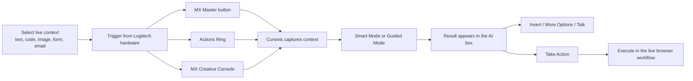
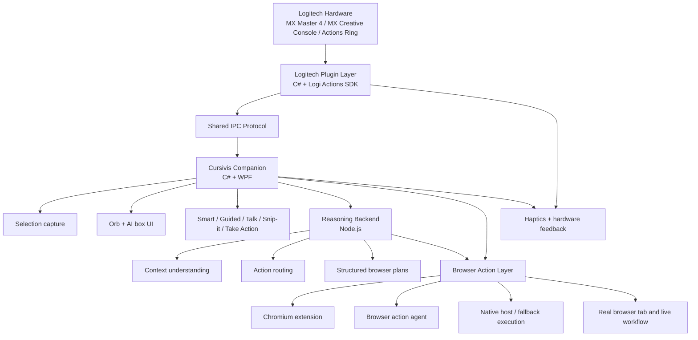

# Cursivis Architecture

Cursivis is a cursor-native workflow layer designed to turn live on-screen context into actionable intelligence.

Instead of asking the user to open a chat interface and manually describe what they are working on, Cursivis starts from the current selection, the current app, and the trigger that was used. That context is captured, interpreted, and routed into the correct flow for response generation or direct execution.

The system is built to work naturally with MX hardware, including MX Master 4, MX Creative Console, and Actions Ring, while also remaining usable through the orb and software-side controls.

## Core Product Model

The system is built around a simple interaction model:

> **Selection = Context, Trigger = Intent, Cursivis = Action**

This means:

- the user selects what matters
- the trigger communicates what kind of interaction they want
- Cursivis decides, guides, or executes the next step

## Workflow Diagram

## Architecture Diagram

## System Components

### Logitech Plugin (`plugin/logitech-plugin`)

Runtime:

- C# + Logi Actions SDK

Role:

- receive trigger actions from Logitech hardware
- receive dial, ring, and adjustment-style control input
- forward commands to the companion over local IPC
- receive and emit haptic feedback events

This layer is what makes Cursivis feel hardware-native rather than simply app-controlled.

### Companion App (`desktop/cursivis-companion`)

Runtime:

- C# + WPF

Role:

- capture current context from the active workflow
- render the orb and result UI
- orchestrate Smart, Guided, Talk, Snip-it, and Take Action flows
- manage clipboard, selection, image, and voice interactions
- coordinate browser-integrated execution

This is the main orchestration layer of the system.

### Reasoning Backend (`backend/llm-agent`)

Runtime:

- Node.js

Role:

- analyze text, image, and voice-enhanced requests
- infer the most useful action in Smart mode
- generate ranked actions in Guided mode
- return result text plus structured browser action plans

This is the reasoning layer behind the interaction model.

### Browser Action Layer

Components:

- `desktop/browser-action-agent`
- `desktop/browser-extension-chromium`
- `desktop/browser-native-host`

Role:

- inspect browser context
- execute safe structured actions
- act in the current real browser tab when available
- fall back to managed-browser automation when needed

This is what allows Cursivis to move from answer generation to real workflow execution.

### Shared Contracts (`shared/ipc-protocol`)

Role:

- define trigger events
- define agent requests and responses
- define browser action plans
- define haptic metadata

This keeps the desktop, backend, and plugin layers aligned through a stable contract surface.

## Core Interaction Flows

### Smart Mode

Smart Mode is the direct path.

Flow:

1. the user selects current context
2. the user triggers from the orb or MX hardware
3. the companion captures the active selection
4. the reasoning backend decides the most useful action
5. Cursivis returns the result
6. the user can optionally press `Take Action`

This mode is designed for speed and low-friction execution.

### Guided Mode

Guided Mode is the explicit choice path.

Flow:

1. the user selects current context
2. the user presses `Trigger`
3. the orb shows relevant predefined options
4. the orb expands with dynamic context-aware options
5. custom remains available at all times
6. the user chooses one path and gets the result

This mode is designed for control, discoverability, and confidence.

### Talk Mode

Talk Mode adds voice refinement on top of the current selection.

Flow:

1. the user selects context
2. the user holds `Talk`
3. voice is captured and transcribed
4. the spoken instruction is combined with the current selection
5. Cursivis runs the refined request

This turns voice into a contextual modifier instead of a separate assistant mode.

### Snip-it

Snip-it is the explicit visual capture path.

Flow:

1. the user triggers image selection
2. the user draws a region
3. the selected region is captured
4. Cursivis analyzes the visual content
5. the result appears in the orb or result UI

This is used for OCR, object understanding, UI interpretation, and image-driven requests.

### Take Action

Take Action is the execution layer.

Flow:

1. the user reviews the generated result
2. the user presses `Take Action`
3. the backend turns the result into a structured browser plan
4. current-tab execution is attempted first
5. managed fallback is used when necessary

This is what allows Cursivis to complete workflows rather than stop at explanation.

## Selection Model

Cursivis supports:

- text
- image
- text + image
- text + voice
- image + voice
- text + image + voice when useful

This matters because the interaction model is not:

- open chat
- explain context
- copy the answer back manually

It is:

- capture what is already on screen
- infer or choose intent
- return or execute the next useful step

## Logitech Interaction Model

The hardware-side interaction model is:

- `Trigger`
  - run the Smart or Guided action flow
- `Talk`
  - hold-to-talk contextual refinement
- `Snip-it`
  - image or region selection
- `Take Action`
  - execute the result in the active workflow
- dial / ring / wheel
  - navigate options, adjust focus, and confirm intent

This is what makes Cursivis feel like a Logitech-native product instead of a generic assistant running in a floating window.

## Runtime Topology

At runtime, the system behaves as a layered loop:

1. Logitech plugin or software-side trigger sends a trigger event
2. the companion captures context and orchestrates UI
3. the reasoning backend returns analysis and plans
4. the browser layer executes real web actions when requested

Each layer is focused:

- plugin layer = hardware intent + haptics
- companion layer = orchestration + UI + capture
- backend layer = reasoning + planning
- browser layer = execution

## Reliability Priorities

The system is designed around a few key priorities:

- always use the latest active selection
- keep Smart Mode flexible and context-aware
- keep Guided Mode relevant to the current selection
- preserve browser action safety and reversibility where possible
- keep the orb and result UI minimal and fast
- hide runtime complexity behind a simple trigger-driven experience

## Architectural Direction

The long-term architectural strength of Cursivis is that it unifies:

- hardware triggers
- on-screen selection
- multimodal context
- reasoning
- execution

That makes it more than an assistant UI. It becomes a workflow layer sitting directly on top of the user's real environment.
