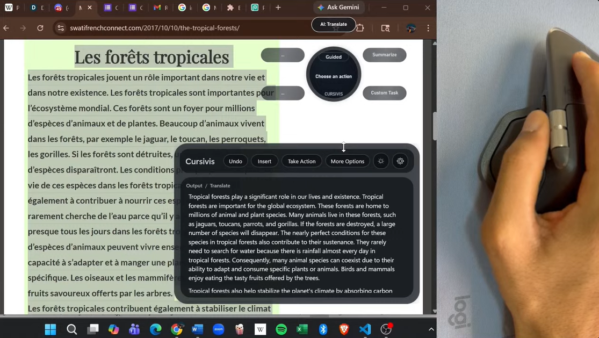
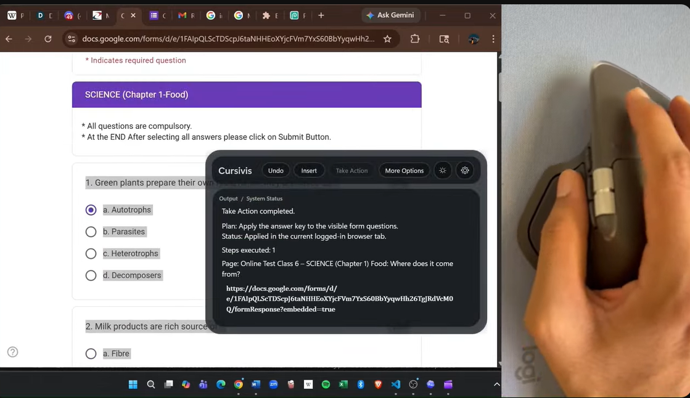
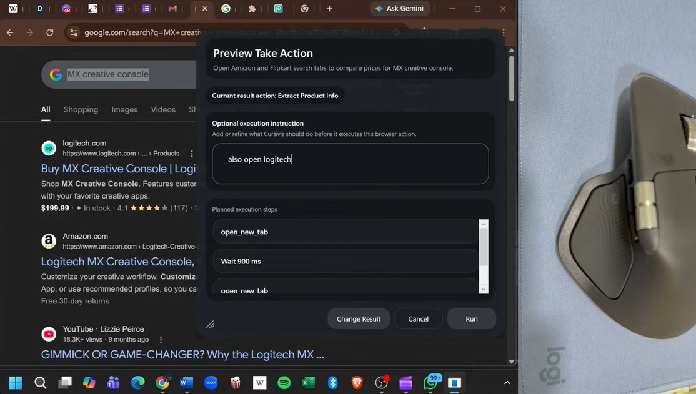
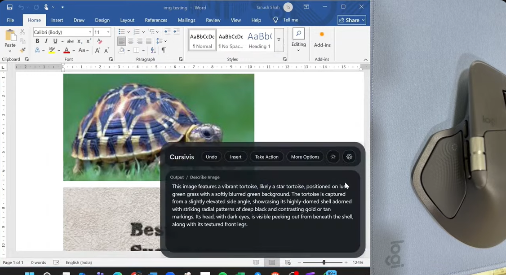
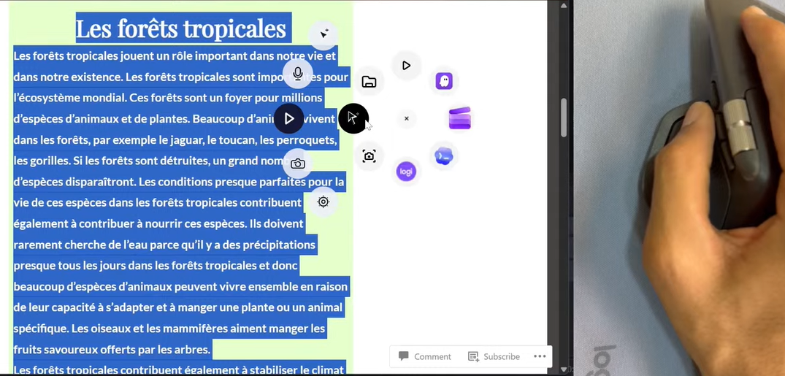
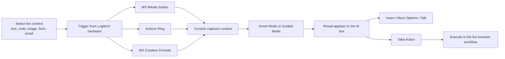
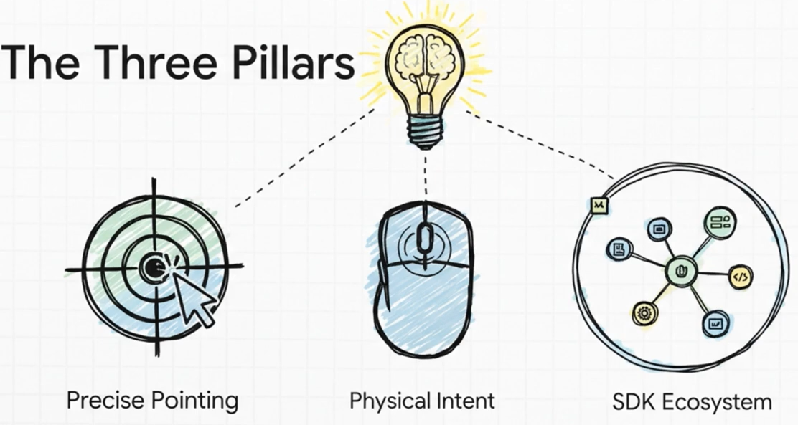
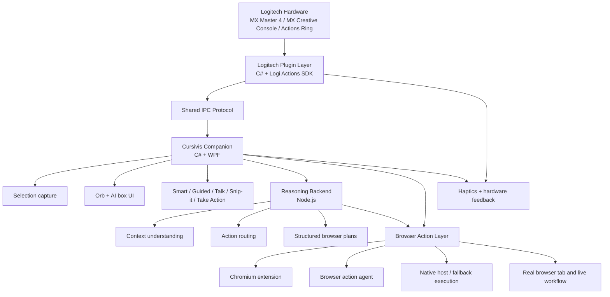

# Cursivis

### What if your cursor could understand intent?

One of the biggest frictions in modern AI workflows is not intelligence. It is interruption.

You select something important, switch tabs, open a chatbot, paste the content, explain what it is, describe what you want, wait for the answer, then manually carry that answer back into the real workflow.

That is slow. It breaks focus. And it makes AI feel like a second app instead of a natural part of work.

Cursivis was built to remove that friction.

Instead of asking the user to leave their workflow, Cursivis brings the power of AI to the click of the cursor. You select what matters, press a trigger on Logitech hardware, and Cursivis understands the context, chooses or offers the best action, and can even execute the next step for you.

It feels less like prompting and more like intent being understood.

Cursor-native workflow intelligence for Logitech MX Master 4, MX Creative Console, and Actions Ring.

Cursivis turns what you are already pointing at into something useful:

- select text, code, an image region, a form, or an email thread
- press a Logitech trigger instead of opening a chat tab
- get the right output for that exact context
- optionally execute the result directly in the live workflow with `Take Action`

This project is built around one core idea:

> **Selection = Context. Trigger = Intent. Cursivis = Action.**

## Product Preview

<p align="center">
  
</p>

<p align="center">
  <em>Select live text, trigger from Logitech MX hardware, and get the right action without leaving the workflow.</em>
</p>

<table>
  <tr>
    <td width="50%" valign="top">
      
      <p align="center"><em>Take Action follows through in the real browser workflow.</em></p>
    </td>
    <td width="50%" valign="top">
      
      <p align="center"><em>Execution can be refined with extra instructions before it runs.</em></p>
    </td>
  </tr>
  <tr>
    <td width="50%" valign="top">
      
      <p align="center"><em>Visual selection works for images, OCR, and on-screen understanding.</em></p>
    </td>
    <td width="50%" valign="top">
      
      <p align="center"><em>The Actions Ring gives direct access to the Cursivis workflow layer.</em></p>
    </td>
  </tr>
</table>

## Installable Logitech Package

For reviewers who want the packaged Logitech plugin directly, the repository already includes:

- [`plugin/logitech-plugin/dist/Cursivis.lplug4`](./plugin/logitech-plugin/dist/Cursivis.lplug4)

The packaged `.lplug4` file is included for direct review and distribution. On a clean machine, the supported install flow is the scripted plugin install in Step 6 below, because it also verifies the package against the local Logi Plugin Service environment.

## Workflow At A Glance



## Why Cursivis Feels Different

Most AI tools begin with a blank box.

Cursivis begins with the thing you are already working on.

That changes the interaction model completely:

- no copy-pasting context into a chatbot
- no re-explaining what the content is
- no switching out of the current app or browser tab
- no dead-end answer when the real task is execution

Instead, Cursivis sits on top of the workflow and turns Logitech hardware into an intelligent intent layer.

## What Makes Cursivis Unique

In one system, Cursivis combines:

- live on-screen context instead of blank-prompt interaction
- Logitech-native hardware control instead of generic shortcuts
- Smart and Guided execution paths
- multimodal understanding across text, image, and voice
- browser follow-through with `Take Action`

That means the demo is not just "AI answered something."

It is:

1. select real work
2. trigger from Logitech hardware
3. get the right result
4. optionally execute the next step immediately

## Built For Logitech

Cursivis is designed to feel natural on Logitech hardware, not merely compatible with it.

<table>
  <tr>
    <td width="50%" valign="top">
      
      <p align="center"><em>Built around precise pointing, physical intent, and the Logitech Actions SDK.</em></p>
    </td>
    <td width="50%" valign="top">
      
      <p align="center"><em>Nested Actions Ring controls make the system feel native to Logitech hardware.</em></p>
    </td>
  </tr>
</table>

### MX Master 4

- A programmable hardware button can be mapped as the instant Cursivis trigger for one-press execution.
- The gesture-button profile is a natural fit for this role in Logi Options+.
- Actions Ring becomes the secondary command layer for fast access to `Trigger`, `Talk`, `Take Action`, `Snip-it`, and `Settings`.
- The thumb wheel and mouse wheel can steer Guided mode choices without moving the pointer away from the current task.
- Haptics communicate state changes such as action selection, processing start, and processing complete.

### Actions Ring

Cursivis uses a nested Actions Ring pattern:

- top-level bubble: `Cursivis`
- nested bubbles:
  - `Trigger`
  - `Talk`
  - `Take Action`
  - `Snip-it`
  - `Settings`

This keeps the top-level ring clean while still making the core system available anywhere.

### MX Creative Console

The same interaction model extends naturally to MX Creative Console:

- dedicated trigger surface
- guided action navigation
- direct `Take Action`
- fast access to voice, image selection, and follow-up commands

## System Architecture



### Repository Map

- `desktop/cursivis-companion`
  - Windows companion app, orb, AI box, selection capture, guided flow, voice flow, result handling
- `plugin/logitech-plugin`
  - Logitech plugin, Actions Ring integration, trigger bridge, haptics
- `backend/llm-agent`
  - reasoning layer and browser action planning
- `desktop/browser-extension-chromium`
  - current-tab browser execution
- `desktop/browser-action-agent`
  - browser automation and execution fallback
- `shared/ipc-protocol`
  - contracts for triggers, responses, plans, and runtime coordination

## What Cursivis Can Do

### Text and language

- Select French text and get an immediate translation.
- Select a dense article and get a concise summary.
- Select a draft and get a polished rewrite.
- Select an email thread and generate a reply in context.

### Code and debugging

- Select code and get a plain-English explanation.
- Select broken code and get a debugging-oriented diagnosis.
- Select implementation code and ask for refactors, comments, or optimization guidance.

### Forms, MCQs, and workflows

- Select MCQs or a question set, run `Trigger`, then press `Take Action` to auto-fill answers in the browser.
- Select a form or web workflow and let Cursivis complete the browser interaction in seconds.
- Select an email thread and let `Take Action` draft or insert the reply into the current compose surface.

### Images and visual context

- Use `Snip-it` to capture a region on screen.
- Describe what is in an image.
- Extract text with OCR.
- Identify objects or interface elements.
- Combine text selection plus image context when both matter.

## The Interaction Loop

### 1. Trigger

`Trigger` is the main entry point.

When you activate it, Cursivis:

1. finds the active external window
2. tries to capture the current selection
3. decides whether the input is text, image, or mixed context
4. routes the task through the reasoning backend
5. returns a result in the AI box

If normal trigger does not detect a usable selection, Cursivis falls back into screen-region capture. If that fallback capture is canceled, Cursivis can sample the pixel under the cursor and return the hex color. This is why the product feels like a true cursor-native assistant instead of just a text tool.

### 2. Smart Mode

In Smart Mode, Cursivis chooses the most useful action automatically.

Example:

- select French text -> translation
- select code -> explanation
- select long prose -> summary
- select a bug report or broken code -> debugging guidance

### 3. Guided Mode

In Guided Mode, Cursivis shows action choices and lets the user steer the result manually.

This is where the Logitech hardware integration becomes especially strong:

- Actions Ring gives quick access to the flow
- the thumb wheel or wheel input moves through the guided options
- pausing on an option can auto-confirm the selection

### 4. Talk

`Talk` adds voice on top of the selected context.

Instead of speaking into a blank assistant, the user says something like:

- "reply politely"
- "count the words"
- "debug this"
- "turn this into bullet points"

Cursivis combines that spoken instruction with the live selection.

### 5. More Options

`More Options` reuses the last selection and result context, then reopens the decision layer so the user can explore other valid actions without reselecting everything.

### 6. Take Action

`Take Action` is what makes Cursivis more than a summarizer.

After Cursivis generates the right answer, it can execute the next step in the live browser workflow:

- fill MCQs
- complete forms
- draft replies
- insert or apply generated content

It prefers acting in the real logged-in tab through the Chromium extension path, then falls back to other supported browser execution paths when needed.

## Why Cursivis Stands Out

Cursivis is not just "AI with Logitech controls."

It demonstrates a stronger product idea:

- Logitech hardware becomes an intent layer, not just a shortcut surface
- the workflow starts from live on-screen context
- the system can both answer and act
- the interaction works across text, code, browser tasks, voice, and image regions

That combination is what makes the project distinctive.

## Runtime Notes

Important notes:

- the product is **not** tied conceptually to one model vendor
- the current repository ships with a default provider-backed reasoning implementation under `backend/llm-agent`
- the Cursivis interaction model remains modular and backend-agnostic
- a single API key is enough to run the stack, and the runtime also supports an optional fallback key pool for uninterrupted sessions

## Getting Started

### 1. Prerequisites

Windows is required for the current companion and Logitech workflow.

Install:

- Windows 10 or 11
- [.NET 8 SDK](https://dotnet.microsoft.com/en-us/download/dotnet/8.0)
- [Node.js 20+](https://nodejs.org/)
- a Chromium browser such as Chrome, Edge, or Brave
- [Logi Options+](https://www.logitech.com/en-in/software/logi-options-plus.html)
- an API key for the default backend implementation in this repo

### 2. Clone the repository

```powershell
git clone https://github.com/UnknownGod2011/MX-Cursivis.git
cd MX-Cursivis
```

If you are working from a downloaded ZIP instead of `git clone`, just open the extracted folder and use the same commands from that directory.

### 3. Set the backend key

The current default backend adapter in this repo expects `GOOGLE_API_KEY`.

```powershell
$env:GOOGLE_API_KEY = "<YOUR_API_KEY>"
```

You can also pass the key directly to the launcher script.

### 4. Start the full Cursivis stack

From the repo root:

```powershell
powershell -ExecutionPolicy Bypass -File .\scripts\run-demo.ps1 -WithBridge -ApiKey "<YOUR_API_KEY>" -EnableStreamingTranscription
```

This starts:

- the reasoning backend
- the browser action agent
- the browser extension bridge host
- the Windows companion app
- the Logitech bridge path used for trigger validation

You should see health confirmations for:

- backend
- browser action agent
- extension bridge host

### 5. Load the Chromium extension

Open your browser and load the unpacked extension from:

- [desktop/browser-extension-chromium](./desktop/browser-extension-chromium)

Steps:

1. Open `chrome://extensions`, `edge://extensions`, or the equivalent page in your Chromium browser.
2. Enable `Developer mode`.
3. Click `Load unpacked`.
4. Select:
   - [desktop/browser-extension-chromium](./desktop/browser-extension-chromium)
5. Keep the extension enabled.
6. Refresh the target tab once before using `Take Action`.

This is what lets Cursivis work inside the browser tab you are already logged into.

### 6. Build and install the Logitech plugin

A prebuilt Logitech package is already included here if you want the packaged artifact directly:

- [`plugin/logitech-plugin/dist/Cursivis.lplug4`](./plugin/logitech-plugin/dist/Cursivis.lplug4)

If you are reviewing the packaged plugin on another Windows machine, keep these prerequisites in place first:

- Logi Options+
- the Chromium extension loaded from `desktop/browser-extension-chromium`
- the local runtime started with `scripts/run-demo.ps1`
- the MX trigger hotkey mapped to `Ctrl + Alt + Space`

From the repo root:

```powershell
powershell -ExecutionPolicy Bypass -File .\scripts\build-logitech-plugin.ps1 -Configuration Release -InstallPackage
```

This will:

- build the real Logitech plugin
- package it as `.lplug4`
- verify the package
- install it into Logi Plugin Service

If Logi Options+ was already open, close and reopen it once after installation.

### 7. Configure Actions Ring

In Logi Options+:

1. Open your MX Master 4.
2. Open `Actions Ring`.
3. Create or select a folder bubble named `Cursivis`.
4. Add these nested actions:
   - `Cursivis Trigger`
   - `Cursivis Talk`
   - `Cursivis Take Action`
   - `Cursivis Snip-it`
   - `Cursivis Settings`

Recommended nested layout:

- `GO`
- `MIC`
- `ACT`
- `SNIP`
- `SET`

### 8. Configure the MX Master 4 trigger

For the fastest interaction, map a programmable mouse button to the Cursivis trigger hotkey:

- `Ctrl + Alt + Space`

This works with the always-on hotkey host so Cursivis can wake and respond even if the companion is not already open.

Recommended Logitech hardware behavior:

- one hardware button = instant `Trigger`
- Actions Ring = secondary Cursivis actions
- thumb wheel / mouse wheel = Guided mode navigation

### 9. Try the core flows

#### Translation

- Select French text
- press `Trigger`

#### Code explanation

- Select code
- press `Trigger`

#### Debugging

- Select broken code or an error block
- press `Trigger`

#### MCQ autofill

- Select the question set
- press `Trigger`
- review the result
- press `Take Action`

#### Email drafting

- Select a live email thread
- press `Trigger`
- optionally press `Take Action` to insert or draft

#### Image understanding

- press `Snip-it`
- drag a region
- let Cursivis describe, OCR, or identify the content

### 10. Stop the demo stack

```powershell
powershell -ExecutionPolicy Bypass -File .\scripts\stop-demo.ps1
```

## If You Are Using An IDE Assistant

If you are using an IDE with an AI coding assistant, you can paste this prompt to start and verify Cursivis:

```text
Open this repository and start the full local Cursivis stack. Use scripts/run-demo.ps1 with the Logitech bridge enabled, keep the companion in background mode, and verify that the backend, browser action agent, extension bridge, and hotkey host are healthy. Then guide me through loading the Chromium extension, building/installing the Logitech plugin, setting up the Cursivis Actions Ring folder, and confirming that Trigger, Talk, Snip-it, and Take Action all work.
```

## Repository Guide For Judges

If you want to review the project quickly, start here:

- [README.md](./README.md)
- [plugin/logitech-plugin/dist/Cursivis.lplug4](./plugin/logitech-plugin/dist/Cursivis.lplug4)
- [plugin/logitech-plugin/CONTROL_MAP.md](./plugin/logitech-plugin/CONTROL_MAP.md)
- [plugin/logitech-plugin/README.md](./plugin/logitech-plugin/README.md)
- [desktop/cursivis-companion/README.md](./desktop/cursivis-companion/README.md)
- [desktop/browser-extension-chromium/README.md](./desktop/browser-extension-chromium/README.md)
- [docs/BUILD_NARRATIVE.md](./docs/BUILD_NARRATIVE.md)
- [docs/ARCHITECTURE_DIAGRAM.md](./docs/ARCHITECTURE_DIAGRAM.md)
- [ARCHITECTURE_PLAN.md](./ARCHITECTURE_PLAN.md)

## Current Status

This repo already includes:

- a working Windows companion app
- Smart Mode and Guided Mode
- voice-triggered refinement
- image region capture
- current-tab browser execution
- Logitech trigger IPC
- Actions Ring integration
- haptic signaling
- take-action browser planning and execution

Cursivis is a premium Logitech-native productivity system built to make AI feel immediate, contextual, and actionable.
